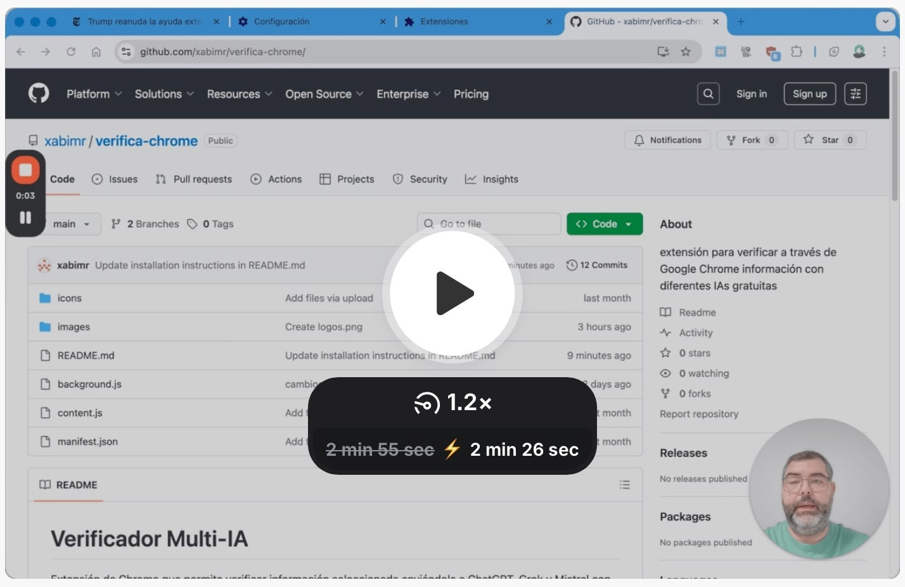

# Verificador Multi-IA

Extensión de Chrome que permite verificar información seleccionada enviándola a ChatGPT, Grok y Mistral con un prompt profesional que incluye perspectiva de género y análisis de sesgos.

## Funcionalidad

1. Selecciona cualquier texto en una página web.
2. Haz clic derecho para abrir el menú contextual.
3. Selecciona "Fact-check con IA y perspectiva de género".
4. Se abrirán 3 pestañas nuevas en orden alfabético:
   - ChatGPT (OpenAI)
   - Grok (X/Twitter)
   - Mistral AI

Cada una con un prompt profesional de verificación de hechos que incluye perspectiva de género, análisis de sesgos y formato estructurado de respuesta.
El prompt que funciona de fondo es el siguiente:

<em>
Eres una/un verificador(a) de hechos profesional. Verifica con rigor periodístico las afirmaciones del siguiente texto buscando fuentes primarias y secundarias reputadas.

CONFIGURACIÓN DE IDIOMA Y ESTILO:
1) Detecta el idioma del texto a verificar y redacta TODO el resultado en ese idioma
2) Usa lenguaje inclusivo y no sexista conforme al idioma detectado
3) Respeta pronombres y nombres autoidentificados si aparecen en fuentes fiables

INSTRUCCIONES:
1) BÚSQUEDA: Prioriza documentos oficiales, organismos públicos, prensa de referencia, bases académicas, informes técnicos, y especialmente plataformas de verificación como Maldita.es, Newtral, Chequeado, PolitiFact o miembros de la International Fact-Checking Network
2) COMPROBACIÓN: Extrae datos clave (cifras, nombres, cargos, fechas) y compáralos entre fuentes independientes
3) SESGOS Y PERSPECTIVA DE GÉNERO: Revisa posibles sesgos, énfasis en vida personal vs. logros, lenguaje estereotipado, ausencia de fuentes diversas
4) VEREDICTO: Etiqueta cada afirmación como Verdadero/Mayoritariamente verdadero/Mixto/Engañoso/Falso/No verificable

FORMATO DE SALIDA:
- Resumen ejecutivo (máx. 5 líneas)
- Hallazgos por afirmación con veredicto y evidencia
- Limitaciones y dudas abiertas
- Fuentes: Medio — Titular — URL — Fecha publicación — Fecha acceso

Texto a verificar: (texto seleccionado)
</em>

## Instalación

1. Descarga la extensión (code > donwload zip) y descomprime la carpeta.
2. Abre Chrome y ve a `chrome://extensions/`.
3. Activa el "Modo de desarrollador" en la esquina superior derecha.
4. Haz clic en "Cargar extensión sin empaquetar".
5. Selecciona la carpeta que contiene estos archivos (descargada en el punto 1).
6. La extensión estará lista para usar.

## Archivos

- `manifest.json`: Configuración de la extensión
- `background.js`: Lógica principal y manejo del menú contextual
- `content.js`: Script de contenido (mínimo por ahora)
- `README.md`: Este archivo de documentación
- `LICENSE`: Licencia

## Videodemostración de uso

[ Ver demostración en Loom](https://www.loom.com/share/8055c37ae30a47718a75c2c2270d1aa6)

## Créditos
Como citar este trabajo:
Martínez Rolán, L. X., Dafonte Gómez, A., Míguez González, M. I., Corbacho Valencia, J. M.,  Piñeiro Otero, T., Castro Souto, L. M., & Padilla Castillo, G. (2025, 29 outubro). Verificador Multi-IA (verifica-chrome [Repositorio en GitHub; extensión de Chrome]). GitHub. https://github.com/xabimr/verifica-chrome

Proyecto financiado por la Cátedra de Feminismos 4.0 DEPO - Uvigo.

## Licencia
Este proyecto está bajo la licencia [CC BY-NC 4.0](https://creativecommons.org/licenses/by-nc/4.0/).  

